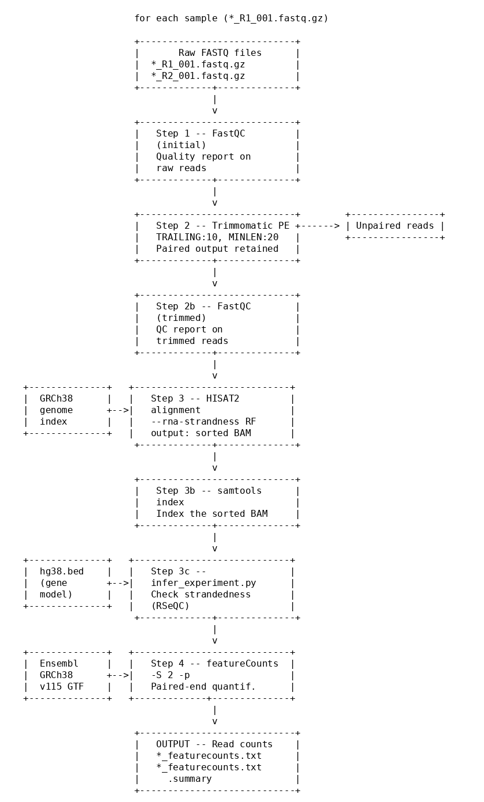

# RNAseq Reads-to-Counts Pipeline

Part of the **AutomateSeq** pipeline collection. This workflow takes raw FASTQ files and produces gene-level read count tables ready for downstream differential expression analysis (e.g. DESeq2, edgeR).

## Pipeline schematic



---

## Scripts

Two scripts are provided depending on your library type:

| Script | Library type | Input per sample |
|--------|-------------|-----------------|
| `MultiRNASeqpipeline.sh` | Single-end | One FASTQ (`*_R1.fastq.gz`) |
| `MultiRNASeqpipeline_Paired.sh` | Paired-end | Two FASTQs (`*_R1_001.fastq.gz`, `*_R2_001.fastq.gz`) |

Choose the script that matches how your library was sequenced. If unsure, check your sequencing facility's run report or inspect the file listing in your `data/` directory — paired-end samples will have both an `_R1` and an `_R2` file per sample.

---

## Dependencies

Install the following before running:

```bash
sudo apt install fastqc trimmomatic hisat2 samtools subread
pip install RSeQC
```

---

## Reference files

The pipeline requires two reference files for human (GRCh38). Download them once and place them as shown:

```bash
# HISAT2 genome index
wget https://genome-idx.s3.amazonaws.com/hisat/grch38_genome.tar.gz
tar -xzvf grch38_genome.tar.gz -C genome/

# Ensembl GTF annotation (release 115)
wget https://ftp.ensembl.org/pub/release-115/gtf/homo_sapiens/Homo_sapiens.GRCh38.115.gtf.gz -P ensembl/
gzip -d ensembl/Homo_sapiens.GRCh38.115.gtf.gz
```

A BED file of gene coordinates (`hg38.bed`) is also required for the strandedness check via RSeQC.

---

## Steps

### Step 1 — Quality control (raw reads)

FastQC is run on the raw input FASTQ(s) to assess base quality, adapter content, and per-sequence GC distribution before any processing.

### Step 2 — Adapter and quality trimming (Trimmomatic)

Low-quality bases are removed from the 3′ end (`TRAILING:10`) and reads shorter than 20 bp after trimming are discarded (`MINLEN:20`).

- **Single-end:** `TrimmomaticSE` produces one trimmed FASTQ per sample.
- **Paired-end:** `TrimmomaticPE` produces paired trimmed FASTQs plus unpaired output files for reads whose mate was discarded.

FastQC is re-run on the trimmed output to confirm quality improvement.

### Step 3 — Alignment (HISAT2 → samtools)

Trimmed reads are aligned to the GRCh38 reference genome using HISAT2, which is splice-aware and suitable for RNA-seq data. Output is piped directly into `samtools sort` to produce a coordinate-sorted BAM.

- **Single-end:** `--rna-strandness R`
- **Paired-end:** `--rna-strandness RF`

The BAM is then indexed with `samtools index`.

#### Strandedness check

`infer_experiment.py` (RSeQC) is run on each BAM to verify library strandedness. Interpret the output as follows:

| Result | Strandedness | featureCounts flag |
|--------|--------------|--------------------|
| ~50/50 split | Unstranded | `-S 0` |
| ~90% `+-` / `-+` | Reverse stranded | `-S 2` |
| ~90% `++` / `--` | Forward stranded | `-S 1` |

If your strandedness differs from the default (`-S 2`), update the `featureCounts` call in the script accordingly.

### Step 4 — Read count quantification (featureCounts)

`featureCounts` (part of the Subread package) counts the number of reads overlapping annotated genes in the Ensembl GRCh38 v115 GTF. Output is a tab-delimited count matrix plus a `.summary` file reporting assignment statistics.

- **Single-end:** standard `featureCounts -S 2`
- **Paired-end:** adds `-p` flag to count fragment pairs rather than individual reads

---

## Expected outputs

```
readCounts/
  {sample}_featurecounts.txt        # gene-level count matrix
  {sample}_featurecounts.txt.summary  # alignment/assignment summary

data/
  {sample}_trimmed.fastq.gz         # trimmed reads (single-end)
  {sample}_R1_trimmed.fastq.gz      # trimmed reads R1 (paired-end)
  {sample}_R2_trimmed.fastq.gz      # trimmed reads R2 (paired-end)
  {sample}_trimmed.bam              # sorted, indexed alignment
  {sample}_trimmed.bam.bai          # BAM index
  *_fastqc.html / *_fastqc.zip      # FastQC reports (pre- and post-trim)
```

---

## Usage

```bash
# Single-end
bash MultiRNASeqpipeline.sh

# Paired-end
bash MultiRNASeqpipeline_Paired.sh
```

Place your raw FASTQ files in a `data/` subdirectory before running. The scripts iterate automatically over all samples matching the expected filename pattern.
